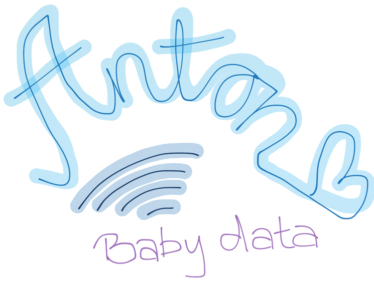

Anton-Baby-Data
==============
Monitoring baby data: sleep, nursing, urination, tantrums

#### Monitoring the vitals and activities of new borns is key to helping them grow healthy, and keeping the parent informed.

The app currently relies on Firebase to run. Implementation from less technical users is tricky at this point, but this is in the works to make the app easier to use and openly available to interested parents.

Right now, the way to use this is to fork and clone the repo. Make a free Firebase account and from the project directory deploy the project to the Firebase hosting.

Step by step instructions:

- Fork and clone repo
- Create a Firebase account and make an app
- Add your app's URL to this line in app.js:

```javascript
var firebaseDB = new Firebase('YOUR-URL-HERE');
```

- copy those rules to your Firebase app

```json
{
  "rules": {
    ".write": "auth != null",
    ".read" : "auth !=null"
  }
}
```

**This tells the app to only allow authorized users to view and edit data.**

- Add yourself as a user in the "Login & Auth" section in Firebase
- Deploy the app to Firebase hosting

```
npm install -g firebase-tools
cd PROJECT_DIR
firebase init
firebase deploy
```

- Run the app, log in and add data. Data will be visible in realtime in Firebase.

## Anton Baby Data is deployed in Firebase and can be previewed at:
https://anton-data.firebaseapp.com

## Android App - simple webview apk, pointing to same URL as above:
https://www.dropbox.com/s/ty0v6hbuxsa107p/Anton-Baby-Data.apk?dl=0

---

## Social Links

- [georgiyanev.me](https://georgiyanev.me)
- [Facebook](https://www.facebook.com/jumpalottahigh/)
- [Twitter](https://www.twitter.com/jumpalottahigh/)
- [LinkedIn](https://www.linkedin.com/in/yanevgeorgi/)
